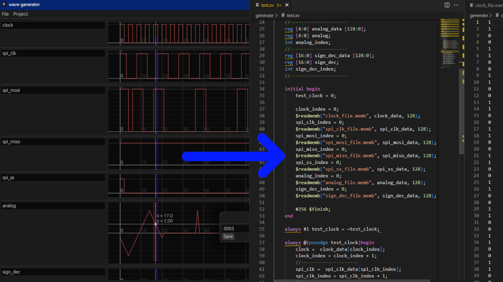

# WaveGen

⚠ This project in developing phase. ⚠

App for create system verilog test by using waveform gui.



## Features

- [x] Save/open project
- [x] Generate System Verilog test code
- [x] Generate Memory files
   - [x] Binary format
   - [ ] Hex format
- [x] Types
   - [x] Clock generate
   - [x] Wire type
   - [x] Reg[512:0] type
- [x] Displays
   - [x] Bit
   - [x] Analog
   - [x] Hex/decimal
- [x] Multiple selection 
- [ ] Import
  - [ ] CSV
  - [ ] VCD

## Control

| Key                | Place          | Action       |
| ------------------ | -------------- | ------------ |
| Right mouse        | Wave name      | Wave params  |
| Right mouse        | Wave Plot      | Edit value   |
| Double Click       | Wave Plot      | Resize plot  |
| Left mouse grab    | Wave Plot      | Move plot    |
| Left mouse grab    | Wave Separator | Resize Plot  |
| Ctrl + Right mouse | Wave Plot      | Select       |
| Key A              | Wave Plot      | Deselect all |
| Ctrl + S           | Anywhere       | Save project |
| Right mouse grab   | Wave Plot      | Box scale    |

## Build and Run

Clone project:
```bash
git clone https://github.com/nrot/WaveGen
```

Build use cargo:
```bash
cargo build --release
```

Run use cargo:
```bash
cargo run --release
```


### Web Locally NOT TESTED

You can compile your app to [WASM](https://en.wikipedia.org/wiki/WebAssembly) and publish it as a web page.

We use [Trunk](https://trunkrs.dev/) to build for web target.
1. Install Trunk with `cargo install --locked trunk`.
2. Run `trunk serve` to build and serve on `http://127.0.0.1:8080`. Trunk will rebuild automatically if you edit the project.
3. Open `http://127.0.0.1:8080/index.html#dev` in a browser. See the warning below.

> `assets/sw.js` script will try to cache our app, and loads the cached version when it cannot connect to server allowing your app to work offline (like PWA).
> appending `#dev` to `index.html` will skip this caching, allowing us to load the latest builds during development.

### Web Deploy NOT TESTED
1. Just run `trunk build --release`.
2. It will generate a `dist` directory as a "static html" website
3. Upload the `dist` directory to any of the numerous free hosting websites including [GitHub Pages](https://docs.github.com/en/free-pro-team@latest/github/working-with-github-pages/configuring-a-publishing-source-for-your-github-pages-site).
4. we already provide a workflow that auto-deploys our app to GitHub pages if you enable it.
> To enable Github Pages, you need to go to Repository -> Settings -> Pages -> Source -> set to `gh-pages` branch and `/` (root).
>
> If `gh-pages` is not available in `Source`, just create and push a branch called `gh-pages` and it should be available.

You can test the template app at <https://emilk.github.io/eframe_template/>.
